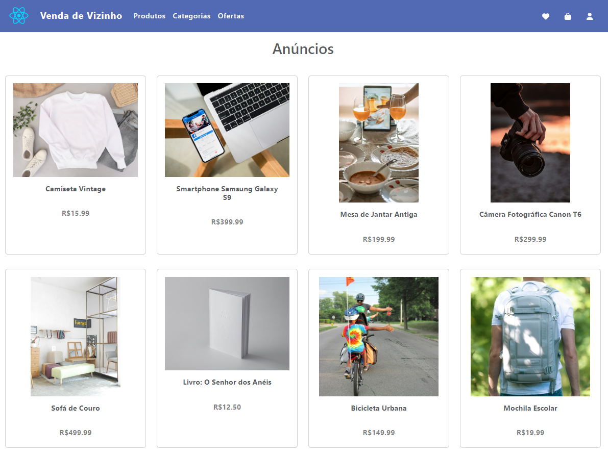
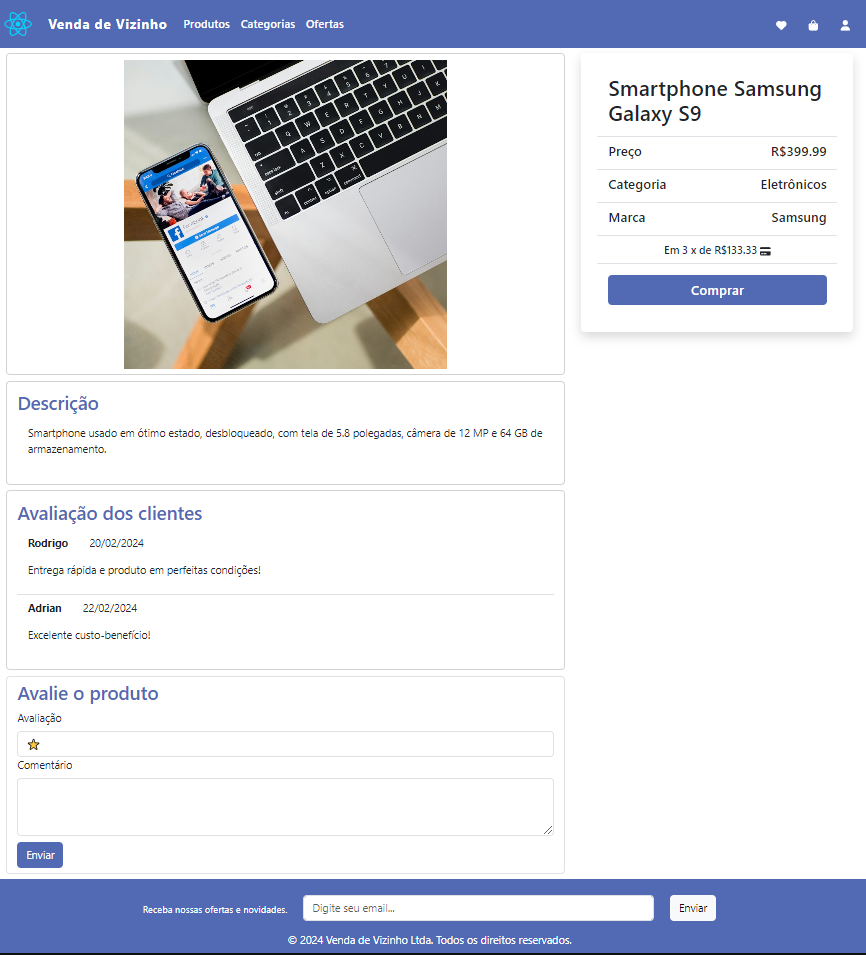

<h1 align="center">Venda de Vizinho Marketplace</h1>

 

## 🚀 Tecnologias

 

 
 

 

## ✨ Layout

  

 

  

## 💹 Implementações Futuras

Como a aplicação está atualmente em estágio de protótipo funcional, podem ser aplicadas diversas melhorias ou criadas novas funcionalidades:
- Carrinho de compras.
- Perfil de usuário.
- Formulário de inclusão de anúncio.
- Chat entre usuários.